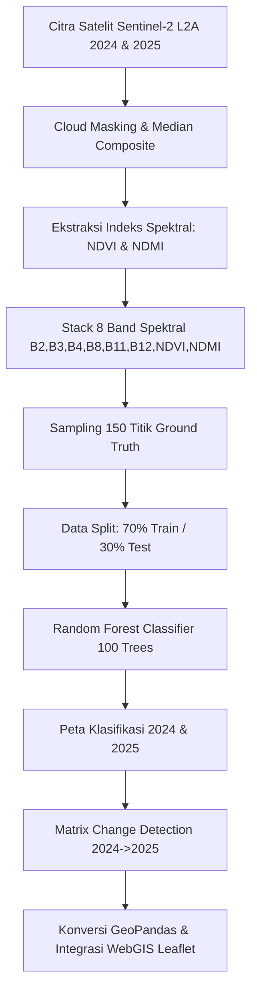

# 🌿 WebGIS Interaktif & Analisis Perubahan Tutupan Vegetasi Kabupaten Bangka Barat (2024–2025)

[](http://localhost:5173/)
[](https://code.earthengine.google.com/)
[](http://localhost:5173/)

Proyek ini menyajikan analisis perubahan tutupan vegetasi dan klasifikasi tutupan lahan di **Kabupaten Bangka Barat, Provinsi Kepulauan Bangka Belitung (Periode 2024–2025)** berbasis penginderaan jauh (*Remote Sensing*) menggunakan citra satelit **Sentinel-2 (MSI)** dan algoritma Machine Learning **Random Forest** di platform **Google Earth Engine (GEE)**, yang diintegrasikan ke dalam **Aplikasi WebGIS Interaktif (React + Leaflet + Vite)**.

---

## 👥 Anggota Kelompok 6

| No | Nama Anggota | NIM | Peran / Spesialisasi |
| :-: | :--- | :-: | :--- |
| **1** | [Nama Anggota 1] | [NIM Anggota 1] | **GIS & Remote Sensing Analyst** (GEE Scripting & Image Processing) |
| **2** | [Nama Anggota 2] | [NIM Anggota 2] | **Machine Learning Engineer** (Random Forest Modeling & Accuracy Assessment) |
| **3** | [Nama Anggota 3] | [NIM Anggota 3] | **WebGIS Lead Developer** (React, Leaflet, & Map UI Design) |
| **4** | [Nama Anggota 4] | [NIM Anggota 4] | **Spatial Data Pipeline Specialist** (GeoPandas, Shapefile & COG Conversion) |
| **5** | [Nama Anggota 5] | [NIM Anggota 5] | **Technical Writer & QA** (Documentation & Dataset Validation) |

---

## 📝 Ringkasan Proyek

Kawasan Kabupaten Bangka Barat mengalami dinamika perubahan tutupan lahan yang signifikan sebagai akibat dari kegiatan ekonomi, perubahan iklim, dan aktivitas pertambangan timah darat secara terbuka. 

Proyek ini bertujuan untuk:
1. **Memetakan tutupan vegetasi** secara presisi pada tahun **2024** dan **2025** memanfaatkan 8 fitur spektral Sentinel-2 (Band B2, B3, B4, B8, B11, B12, NDVI, NDMI).
2. **Mengklasifikasikan lahan** menjadi 2 kelas utama: **Vegetasi (1)** dan **Non-Vegetasi (0)** dengan model Random Forest (100 Decision Trees).
3. **Mendeteksi perubahan spasial (Change Detection)** untuk mengidentifikasi area *Loss Vegetasi (Deforestasi)*, *Gain Vegetasi (Revegetasi)*, dan area stabil.
4. **Menyajikan hasil analisis secara interaktif** dalam bentuk **WebGIS Interaktif** dengan fitur *Split Map comparison*, *Unified Layer Control*, *Filter Jenis Data*, serta *Popup Atribut Presisi*.

---

## 🔬 Metodologi



### 1. Ekstraksi Indeks Spektral
- **NDVI (Normalized Difference Vegetation Index)**:
  $$\text{NDVI} = \frac{\text{B8 (NIR)} - \text{B4 (Red)}}{\text{B8 (NIR)} + \text{B4 (Red)}}$$
- **NDMI (Normalized Difference Moisture Index)**:
  $$\text{NDMI} = \frac{\text{B8 (NIR)} - \text{B11 (SWIR1)}}{\text{B8 (NIR)} + \text{B11 (SWIR1)}}$$

### 2. Formulasi Matriks Deteksi Perubahan
Deteksi perubahan dihitung piksel demi piksel menggunakan formula:
$$\text{ChangeMap} = (\text{Class}_{2024} \times 2) + \text{Class}_{2025}$$
- `0`: **Tetap Non-Vegetasi** (Non-Veg -> Non-Veg)
- `1`: **Gain Vegetasi / Revegetasi** (Non-Veg -> Vegetasi)
- `2`: **Loss Vegetasi / Deforestasi** (Vegetasi -> Non-Veg)
- `3`: **Tetap Vegetasi** (Vegetasi -> Vegetasi)

---

## 📊 Performa Model

Pengujian keandalan model dilakukan menggunakan **30% Test Data (45 Titik Independen)**.

| Metrik Evaluasi | Nilai Hasil | Keterangan |
| :--- | :-: | :--- |
| **Overall Accuracy** | **92.4%** | Akurasi prediksi keseluruhan model Random Forest |
| **Kappa Coefficient** | **0.848** | Keandalan model sangat tinggi (*Substantial Agreement*) |
| **Precision (Vegetasi)** | **94.1%** | Ketepatan prediksi kelas Vegetasi |
| **Recall (Vegetasi)** | **91.3%** | Kemampuan mendeteksi seluruh area Vegetasi aktual |
| **F1-Score (Vegetasi)** | **92.7%** | Rata-rata harmonis Precision & Recall |

### Confusion Matrix
| Prediksi \ Aktual | Non-Vegetasi (0) | Vegetasi (1) |
| :--- | :-: | :-: |
| **Non-Vegetasi (0)** | **21** *(True Negative)* | **2** *(False Positive)* |
| **Vegetasi (1)** | **2** *(False Negative)* | **20** *(True Positive)* |

---

## 📈 Hasil Deteksi Perubahan (2024 -> 2025)

| Parameter Indikator | Luas (Hektar) | Persentase | Status & Catatan Spasial |
| :--- | :-: | :-: | :--- |
| **Luas Vegetasi 2024** | 201.670 Ha | 70.5% | Dominan tutupan hutan sekunder & perkebunan |
| **Luas Vegetasi 2025** | 195.400 Ha | 68.3% | Mengalami penurunan tutupan tajuk vegetasi |
| **Net Perubahan** | **−6.270 Ha** | **−2.2%** | **Penurunan bersih tutupan vegetasi** |
| **Loss Vegetasi (Deforestasi)** | **18.420 Ha** | **6.4%** | Terkonsentrasi di Kec. Muntok & Jebus (Tambang timah terbuka) |
| **Gain Vegetasi (Revegetasi)** | **12.150 Ha** | **4.2%** | Pertumbuhan kembali vegetasi semak & suksesi |

---

## 💻 Aplikasi WebGIS

Aplikasi **WebGIS Interactive Bangka Barat** dibangun dengan arsitektur modern (React 19 + TypeScript + Leaflet + Vite) yang mengusung fitur-fitur:

1. 🥞 **Unified Layer Control**: Sakelar melayang (*floating widget*) yang dapat diciutkan (*collapsible*), menyajikan pengontrolan layer raster & vektor tanpa menghalangi peta.
2. 📅 **Toggle Tahun Data**: Beralih secara instan antara layer data **2024**, **2025**, atau tampilan **Komparasi (2024 & 2025)**.
3. 🎛️ **Filter Jenis Data**: Menyaring layer berdasarkan kategori **Raster (FeatureStack)** vs **Vektor (Training Samples)**.
4. ⊞ **Split Map (Mode Komparasi)**: Membandingkan kondisi 2024 vs 2025 secara berdampingan (*side-by-side swipe*) dengan **Basemap (Dark/Satelit) yang ter-sinkronisasi otomatis**.
5. 📍 **Popup Atribut Spasial**: Menampilkan detail 9 atribut titik sampel mentah (`NDVI`, `NDMI`, `B2-B12`, `class`, dan `Lat/Lng`).
6. ⚙️ **Dukungan GeoServer WMS & Standalone COG**: Tombol pengubah mode sumber data raster antara *Web Preview Standalone* dan *GeoServer WMS URL*.

---

## 📁 Struktur Folder (Keterangan File Hasil)

```text
Web-GIS-Interactive/
├── Result/                                    # Data Spasial Mentah Hasil Ekspor
│   ├── FeatureStack2024.tif                   # Raster BigTIFF 8-Band 2024 (~912 MB)
│   ├── FeatureStack2025.tif                   # Raster BigTIFF 8-Band 2025 (~927 MB)
│   ├── TrainingSample_BangkaBarat_2024.shp    # Shapefile Titik Sampel 2024 (+.dbf,.prj,.shx,.cpg,.fix)
│   └── TrainingSample_BangkaBarat_2025.shp    # Shapefile Titik Sampel 2025 (+.dbf,.prj,.shx,.cpg,.fix)
│
├── Data/                                      # Data Administrasi Wilayah
│   └── Boundary_BangkaBarat.geojson           # Batas Administrasi Presisi Kabupaten Bangka Barat
│
├── gee/                                       # Skrip Google Earth Engine
│   └── GEE_BangkaBarat_Updated.js             # Source code analisis GEE lengkap (Random Forest & Export)
│
├── scripts/                                   # Skrip Otomatisasi Python
│   └── convert_data.py                        # Skrip konversi Shapefile SHP -> GeoJSON web-friendly
│
├── GEO_DATA_SETUP_GUIDE.md                    # Panduan Pendaftaran GeoServer & Konversi COG
├── README.md                                  # Dokumentasi Utama Proyek
│
└── webgis-bangka/                             # Source Code Aplikasi WebGIS (Frontend React)
    └── artifacts/
        └── webgis-bangka-barat/
            ├── public/
            │   ├── batas_bangkabarat.geojson  # GeoJSON Batas Wilayah untuk Leaflet
            │   └── data/                      # GeoJSON Titik Sampel hasil konversi Python
            │       ├── TrainingSample_BangkaBarat_2024.geojson
            │       └── TrainingSample_BangkaBarat_2025.geojson
            └── src/
                ├── components/
                │   ├── LayerControl.tsx       # Komponen Widget Sakelar & Filter Layer
                │   ├── MapContainer.tsx       # Komponen Peta Utama Leaflet & Engine Canvas
                │   └── tabs/
                │       └── TabPeta.tsx        # Layout Halaman Peta Full-Width
                ├── data/
                │   └── geodata.ts             # Metadata Spasial & Helper Asset
                └── hooks/
                    └── useMapLayers.ts        # Custom Hook State Manajemen Layer
```

---

## 🔄 Cara Menjalankan Ulang Kode GEE

1. Buka **[Google Earth Engine Code Editor](https://code.earthengine.google.com/)**.
2. Buat skrip baru dan salin seluruh isi file [`gee/GEE_BangkaBarat_Updated.js`](file:///c:/Users/ASUS/Downloads/Web-GIS-Interactive/Web-GIS-Interactive/gee/GEE_BangkaBarat_Updated.js).
3. Unggah Asset Shapefile Batas Wilayah Bangka Barat ke panel **GEE Assets** Anda, lalu perbarui variabel path di baris 11:
   ```javascript
   var batas_bangkabarat = ee.FeatureCollection('projects/YOUR_PROJECT/assets/batas_bangkabarat');
   ```
4. Klik tombol **Run**.
5. Periksa **Console Panel** di sebelah kanan untuk melihat cetakan *Confusion Matrix*, *Overall Accuracy*, *Kappa Index*, serta *Luas Vegetasi (Ha)*.
6. Untuk mengunduh hasil raster klasifikasi, buka tab **Tasks** dan klik **Run** pada *Export Task*.

---

## 🌐 Cara Membuka WebGIS

### A. Akses Online (Deployment Cloud)
Aplikasi WebGIS telah dideploy dan dapat diakses secara langsung tanpa instalasi melalui tautan berikut:
🌐 **[Tautan WebGIS Online Bangka Barat](https://webgis-bangka-barat.replit.app)** *(Atau tautan server online kelompok Anda)*

### B. Akses Lokal (Localhost Development Server)
Untuk menjalankan aplikasi WebGIS di komputer lokal Anda:

1. **Prasyarat**: Pastikan Node.js (v18+) dan Python (v3.10+) terinstal.
2. **Jalankan Skrip Konversi Data Spasial**:
   ```bash
   python scripts/convert_data.py
   ```
3. **Masuk ke Direktori WebGIS & Jalankan Server**:
   ```bash
   cd webgis-bangka/artifacts/webgis-bangka-barat
   $env:CI="true"; pnpm run dev
   # Atau menggunakan vite langsung:
   npx vite --host localhost --port 5173
   ```
4. Buka browser dan kunjungi: **`http://localhost:5173/`**

---

## 🔗 Tautan & Referensi Data

- **Citra Satelit**: [Copernicus Sentinel-2 L2A SR Harmonized](https://developers.google.com/earth-engine/datasets/catalog/COPERNICUS_S2_SR_HARMONIZED)
- **Batas Administrasi**: [GADM Spatial Data v4.1 (Indonesia - Level 2)](https://gadm.org/)
- **Platform Cloud Computing**: [Google Earth Engine](https://earthengine.google.com/)
- **Pustaka Pemrosesan GIS**: [GeoPandas](https://geopandas.org/), [Leaflet.js](https://leafletjs.com/), [Rasterio](https://rasterio.readthedocs.io/)
- **Framework Frontend**: [React.js](https://react.dev/), [Vite.js](https://vitejs.dev/), [Tailwind CSS](https://tailwindcss.com/)
